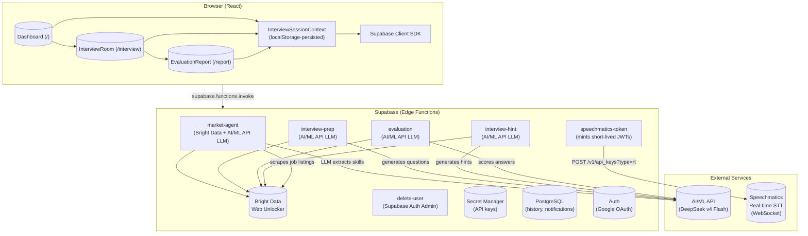

# 🎯 Fuenzer Career | AI Interview Coach with Voice Practice

[](https://www.typescriptlang.org/)
[](https://react.dev/)
[](https://vite.dev/)
[](https://tailwindcss.com/)
[](https://supabase.com/)
[](LICENSE)
[](https://github.com/Yogs4R/fuenzer-career)

---

> **Nail Your Next Interview** — Practise with voice-driven mock interviews, get AI-powered feedback, and track your progress over time. No account required.

Fuenzer Career is a **career intelligence and interview coaching platform** that helps job seekers project confidence during interviews. It combines **live market research** (via Bright Data), **real-time voice transcription** (via Speechmatics), and **AI-powered evaluation** (via AI/ML API) in a single, seamless experience.

Built with ❤️ for the [NativelyAI Hackathon](https://nativelyai.com).

---

## 📖 Table of Contents

- [Features](#-features)
- [Live Demo](#-live-demo)
- [Screenshots](#-screenshots)
- [Architecture](#%EF%B8%8F-architecture)
- [Tech Stack](#%EF%B8%8F-tech-stack)
- [Project Structure](#-project-structure)
- [Routes](#-routes)
- [Edge Functions](#-edge-functions)
- [Getting Started](#-getting-started)
- [Authentication Model](#-authentication-model)
- [Data Flow](#-data-flow-happy-path)
- [Key Design Patterns](#-key-design-patterns)
- [Hackathon Awards Category](#-hackathon-awards-category)
- [License](#-license)
- [Team](#-team)
- [Acknowledgments](#-acknowledgments)

---

## ✨ Features

| Feature | Description |
|---------|-------------|
| 🔍 **Live Market Research** | Scrapes LinkedIn & Indeed via **Bright Data** Web Unlocker, then **AI/ML API (DeepSeek)** extracts trending skills for your target role |
| 🎤 **Voice Interview Practice** | Answer questions aloud with real-time transcription via **Speechmatics** WebSocket (16 kHz PCM, partial + final captions) |
| 🤖 **AI-Generated Questions** | Contextual interview questions generated by **AI/ML API (DeepSeek)** based on your role, selected skills, and market data |
| 📊 **Instant AI Feedback** | Per-question scoring, skill-match analysis, and delivery insights — all powered by **AI/ML API** |
| 🗣️ **Filler Word Detection** | Real-time tracking of "um", "uh", "like" and other hesitation patterns via **Speechmatics** disfluency tags |
| 🌍 **Multi-Language** | 6 languages: English, German, French, Indonesian, Japanese, Chinese — full i18n with SEO meta tags per locale |
| 🔐 **Guest-First** | No sign-up required — all features work instantly as a guest; sign in later with Google to save history |
| 📈 **Progress Tracking** | Sign in with Google to save interview history, track improvement over time, and receive notifications |

---

## 🚀 Live Demo

[](https://21v8y7jsmp02dfsevr4cz79bq.nativelyai.app)

---

## 📸 Screenshots

| Dashboard | Interview Room | Evaluation Report |
|-----------|---------------|-------------------|
| Hero with role combobox, trending skills carousel, agent workflow, testimonials, FAQ | Live transcription, audio visualizer, STAR method hints, per-question progress | Score gauge, per-question breakdown, skill match, filler word analysis |

---

## 🏗️ Architecture



### Key Design Decisions

| Decision | Rationale |
|----------|-----------|
| **Guest-first architecture** | Zero friction — user starts practicing immediately, no sign-up wall |
| **Edge Functions for all AI calls** | API keys never reach the browser; CORS + short-lived JWTs ensure security |
| **LocalStorage persistence** | Guest sessions survive page reloads without a database |
| **Single React Context** | `InterviewSessionContext` holds all state across the 3-page flow |
| **WebSocket for transcription** | Low-latency real-time captions vs. batch upload — key never reaches browser, only a 60-second JWT |
| **LLM as parser** | Pass raw scraped HTML text to the LLM instead of brittle HTML selectors |

---

## 🛠️ Tech Stack

| Layer | Technology |
|-------|-----------|
| **Frontend** | React 18, TypeScript 5.9, Vite 7.2 |
| **Styling** | Tailwind CSS 4.1 with custom design tokens |
| **Routing** | react-router-dom v7 |
| **Backend** | Supabase Edge Functions (Deno) |
| **Auth** | Supabase Auth (Google OAuth) |
| **Database** | Supabase PostgreSQL (interview_history, notifications) |
| **Speech-to-Text** | **Speechmatics** Real-Time API (WebSocket) |
| **Web Scraping** | **Bright Data** Web Unlocker |
| **AI / LLM** | **AI/ML API** (`deepseek/deepseek-v4-flash`, OpenAI-compatible) |
| **Analytics** | Google Analytics G-MKSPXBHK42 (opt-in via cookie consent) |

---

## 🧩 Project Structure

```
fuenzer-career/
├── public/
│   ├── robots.txt
│   ├── sitemap.xml
│   └── *.svg                  # Logos & OG image
├── src/
│   ├── components/
│   │   ├── NavBar.tsx          # Responsive nav with auth, history, notifications, i18n
│   │   ├── CookieConsent.tsx   # GDPR-compliant Google Analytics opt-in
│   │   ├── RoleCombobox.tsx    # Typeahead combobox for job roles (60+ presets)
│   │   └── InterviewConfigModal.tsx  # Keyword selection & question config modal
│   ├── hooks/
│   │   ├── useSEOMeta.ts      # Dynamic title + meta + OG + Twitter tags (i18n-aware)
│   │   └── usePageTitle.ts    # Legacy page title hook
│   ├── lib/
│   │   ├── i18n.ts             # i18n engine with 6 locale files
│   │   ├── i18n/en.ts / de.ts / fr.ts / id.ts / ja.ts / zh.ts
│   │   ├── supabaseClient.ts   # Supabase SDK singleton
│   │   ├── AuthContext.tsx      # Auth state management
│   │   ├── InterviewSession.tsx # Guest interview state (localStorage-persisted)
│   │   ├── audio.ts            # PCM 16 kHz audio capture pipeline
│   │   ├── speechmatics.ts     # WebSocket transcription + filler detection
│   │   └── sectionLink.ts      # Cross-route hash link handler
│   ├── pages/
│   │   ├── Dashboard.tsx       # Landing page (8 sections)
│   │   ├── InterviewRoom.tsx   # Voice interview with live transcription
│   │   ├── EvaluationReport.tsx# Score gauge, per-question breakdown, analysis
│   │   ├── Login.tsx           # Google OAuth + guest access
│   │   ├── SignUp.tsx          # Sign-up with Google
│   │   ├── Privacy.tsx         # Privacy policy
│   │   ├── Terms.tsx           # Terms of service
│   │   └── NotFound.tsx        # 404 page
│   ├── App.tsx                 # Root: BrowserRouter → providers → routes
│   ├── main.tsx                # Entry point
│   └── index.css               # Design tokens, animations, keyframes
├── docs/
│   ├── prd/                    # Product requirements & phase docs
│   ├── specs/                  # Detailed specifications
│   ├── design-system/          # Design tokens and component specs
│   ├── ARCHITECTURE.md         # System architecture deep-dive
│   ├── DESIGN.md               # Design system & UX guidelines
│   └── AGENTS.md               # AI agent pipeline documentation
├── LICENSE                     # Apache 2.0
└── README.md                   # You are here
```

---

## 🚦 Routes

| Path | Page | Description |
|------|------|-------------|
| `/` | Dashboard | Landing page with hero, skills, agent workflow, testimonials, FAQ, footer |
| `/interview` | InterviewRoom | Voice interview with live transcription and AI hints |
| `/report` | EvaluationReport | Score gauge, per-question breakdown, skill match, filler analysis |
| `/login` | Login | Sign in with Google or continue as guest |
| `/signup` | Sign Up | Create account with Google |
| `/privacy` | Privacy Policy | Data handling, cookies, Google Analytics disclosure |
| `/terms` | Terms of Service | Usage terms, age requirements |
| `*` | 404 Not Found | Catch-all with navigation help |

---

## 🧪 Edge Functions

| Function | Purpose | Service(s) Used | Secrets | Transport |
|----------|---------|-----------------|---------|-----------|
| `market-agent` | Scrapes LinkedIn & Indeed via Bright Data → LLM extracts keywords | **Bright Data**, **AI/ML API** | `BRIGHT_DATA_API_TOKEN`, `AIMLAPI_API_KEY` | REST |
| `interview-prep` | Generates contextual interview questions | **AI/ML API** | `AIMLAPI_API_KEY` | REST |
| `interview-hint` | Generates per-question STAR-method hints | **AI/ML API** | `AIMLAPI_API_KEY` | REST |
| `evaluation` | Scores answers, analyzes skill match & delivery | **AI/ML API** | `AIMLAPI_API_KEY` | REST |
| `speechmatics-token` | Mints short-lived JWTs for Speechmatics WebSocket | **Speechmatics** | `SPEECHMATICS_API_KEY` | REST |
| `delete-user` | Deletes authenticated user account | Supabase Auth Admin | Supabase Admin | REST |

All functions are deployed with `verify_jwt: false` (guest-first) and include CORS handling.

---

## 🚀 Getting Started

### Prerequisites

- Node.js 20+
- npm
- Supabase account (free tier)
- **Bright Data** account (Web Unlocker zone)
- **AI/ML API** account with API key
- **Speechmatics** account with API key

### Installation

```bash
# Clone the repository
git clone https://github.com/Yogs4R/fuenzer-career.git
cd fuenzer-career

# Install dependencies
npm install

# Start development server
npm run dev
```

### Environment Setup

Secrets are managed through **Supabase Edge Function Secrets** (never `.env` files). Store these via the Supabase dashboard:

| Secret | Description | Used By |
|--------|-------------|---------|
| `BRIGHT_DATA_API_TOKEN` | Bright Data Web Unlocker API token | `market-agent` |
| `AIMLAPI_API_KEY` | AI/ML API key for `deepseek/deepseek-v4-flash` | All LLM Edge Functions |
| `SPEECHMATICS_API_KEY` | Speechmatics real-time API key | `speechmatics-token` |

The Supabase anon/publishable key is safe in client source (`src/lib/supabaseClient.ts`).

---

## 🔐 Authentication Model

```
                    ┌────────────────────┐
                    │  Supabase Auth     │
                    │  (Google OAuth)    │
                    └────────┬───────────┘
                             │
              ┌──────────────┴──────────────┐
              │  Guest mode                 │
              │  (default, no sign-up)      │
              └──────────────┬──────────────┘
                             │
        ┌────────────────────┴────────────────────┐
        │  LocalStorage session                   │
        │  (role, keywords, questions, answers,   │
        │   evaluation) persisted automatically   │
        └─────────────────────────────────────────┘
```

- **Guest users**: Full interview flow, evaluation, all features — no barrier
- **Authenticated users**: Same experience + history saved to Supabase DB, progress tracking, notifications

---

## 📊 Data Flow (Happy Path)

```
1. User enters role → Dashboard
2. Dashboard → market-agent → Bright Data scrapes LinkedIn & Indeed
3. market-agent → AI/ML API LLM → extracts trending keywords
4. User selects keywords → Dashboard → interview-prep → AI/ML API → questions
5. Navigate to InterviewRoom → speechmatics-token → Speechmatics mints a 60-second JWT
6. User speaks → 16 kHz PCM streamed via WebSocket → live partial captions from Speechmatics
7. On stop → final transcript + filler word counts stored per question
8. User finishes → evaluation Edge Function → AI/ML API scores each answer
9. Navigate to EvaluationReport → full breakdown rendered
```

---

## 🌟 Key Design Patterns

- **Agentic Pipeline**: Three AI agents (Market → Interviewer → Evaluation) form a sequential pipeline, each consuming the previous output
- **State Machine**: Microphone uses 3-state machine (`idle` → `recording` → `processing`) with corresponding UI
- **Rate Limiting**: Cooldown between market research calls prevents API abuse
- **Graceful Degradation**: Mic denied → textarea fallback; API failure → cached skills; scraping failure → general skills only
- **Optimistic UI**: Loading overlays with elapsed-time indicators keep the user informed during async operations
- **Responsive Design**: All 8 landing page sections + nav + modals adapt from 375px to 1440px
- **i18n + SEO**: Dynamic page titles, meta descriptions, and Open Graph tags switch with language — 6 locales supported

---

## 🏆 Hackathon Awards Category

Fuenzer Career is designed for the **Best Use of AI/ML API**, **Top Speechmatics Projects** and **Best Agentic Use of Bright Data** categories:

- **Real AI, not mock**: Every piece of content is generated live by AI (skills, questions, hints, evaluation)
- **Voice as primary input**: Speechmatics WebSocket with real-time filler detection is the core interaction
- **No auth wall**: Demonstrates that AI-powered products can be accessible instantly
- **Agentic architecture**: Multiple specialized AI agents collaborating in a pipeline

---

## 📄 License

This project is licensed under the **Apache License 2.0** — see the [LICENSE](LICENSE) file for details.

---

## 👥 Team

- **Ridwan** — Architecture, Full-Stack Development, AI Integration
- Built with [NativelyAI](https://nativelyai.com) Conductor Platform

---

## 🙏 Acknowledgments

- [Supabase](https://supabase.com) — Backend, Auth, Edge Functions
- [Speechmatics](https://speechmatics.com) — Real-time speech-to-text
- [Bright Data](https://brightdata.com) — Web scraping infrastructure
- [AI/ML API](https://aimlapi.com) — LLM inference
- [Tailwind CSS](https://tailwindcss.com) — Styling framework
- [NativelyAI](https://nativelyai.com) — Project conductor platform

---

<p align="center">
  Built with ❤️ for the NativelyAI Hackathon<br>
  <a href="https://21v8y7jsmp02dfsevr4cz79bq.nativelyai.app"><strong>Try Fuenzer Career →</strong></a>
</p>
