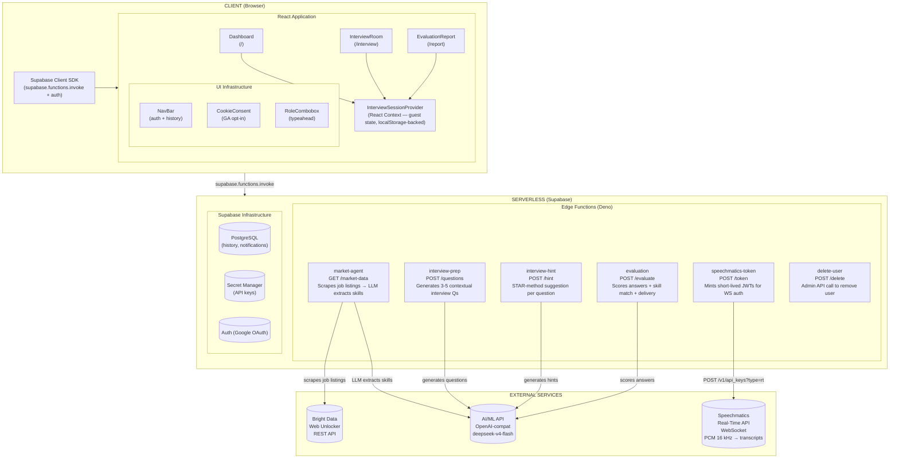
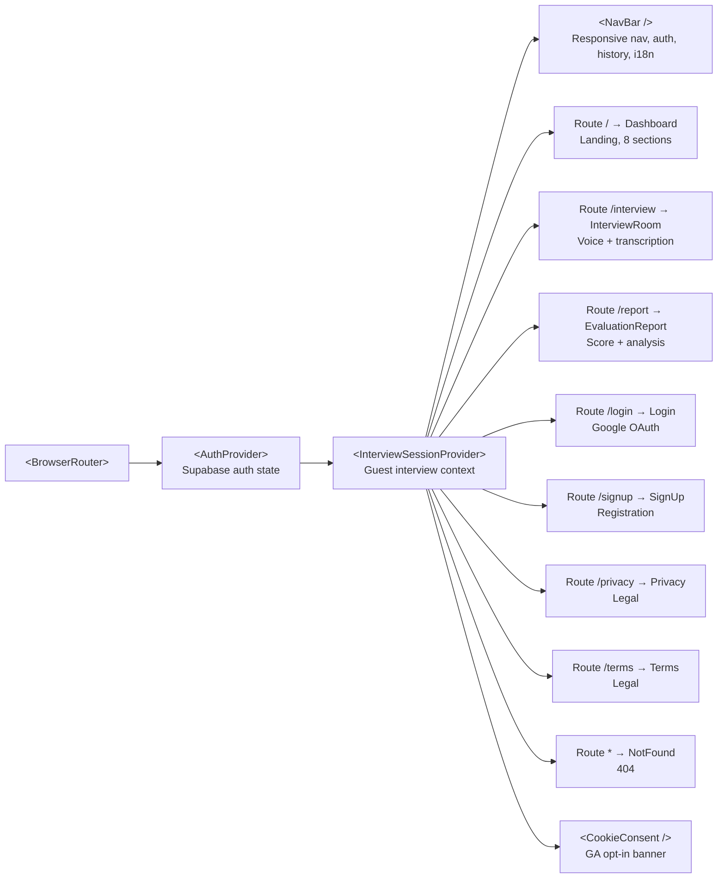
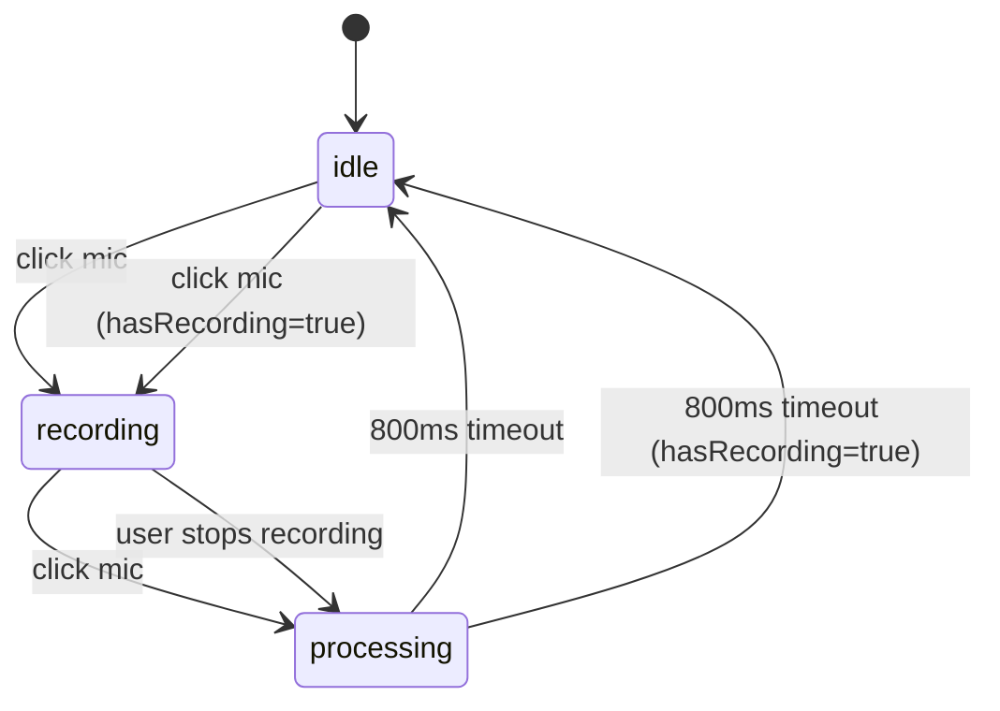
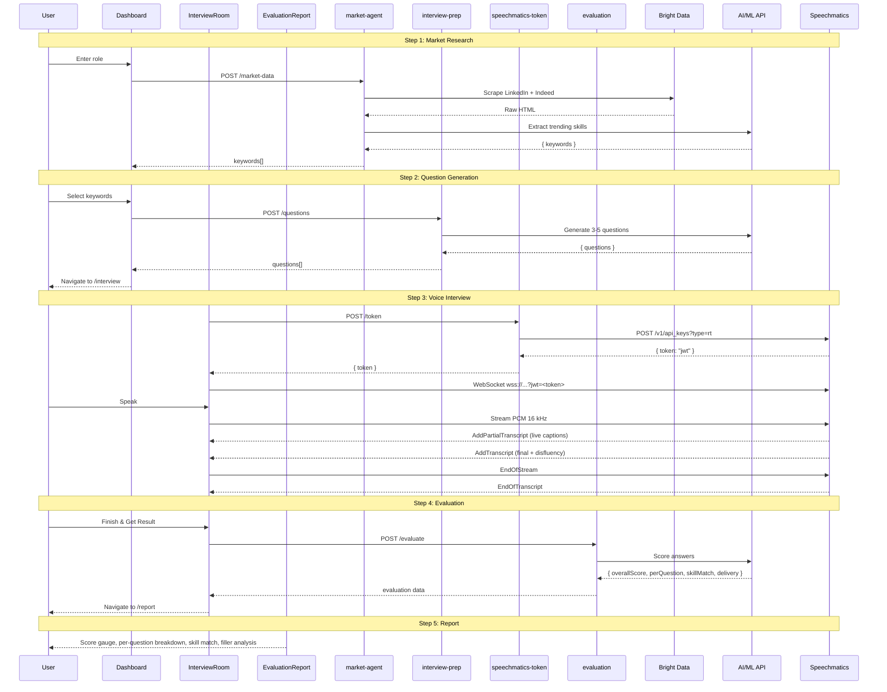
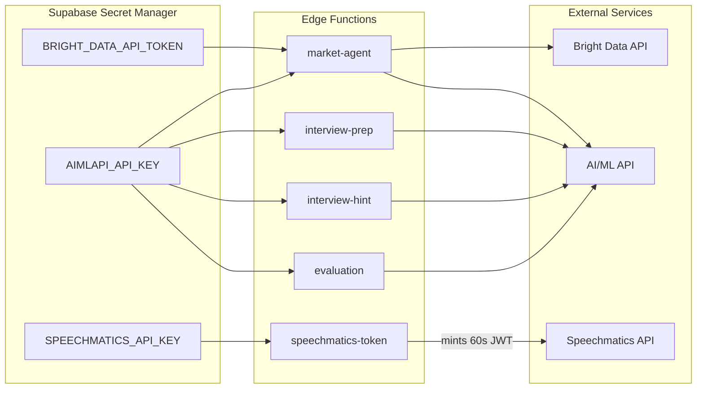
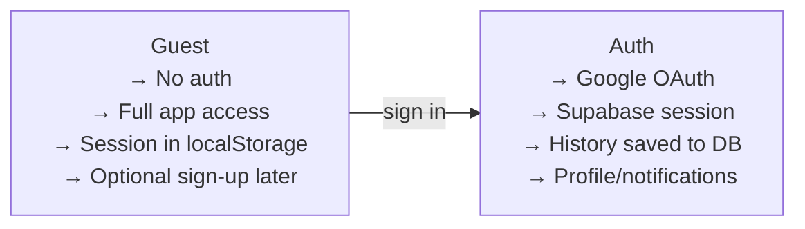

# Fuenzer Career | Architecture Document

## Table of Contents

- [System Overview](#system-overview)
- [Component Hierarchy](#component-hierarchy)
- [State Management](#state-management)
- [Data Flow — Complete Happy Path](#data-flow--complete-happy-path)
- [API Contract — Edge Functions](#api-contract--edge-functions)
- [Database Schema](#database-schema)
- [Security Architecture](#security-architecture)
- [Error Handling Strategy](#error-handling-strategy)
- [Performance Considerations](#performance-considerations)
- [Key Design Patterns](#key-design-patterns)

---

## System Overview

Fuenzer Career is a **guest-first, AI-powered interview coaching platform** built on a serverless architecture. The entire backend runs as Supabase Edge Functions (Deno), and the frontend is a single-page React application.



---

## Component Hierarchy



---

## State Management

### AuthContext (`src/lib/AuthContext.tsx`)

| Property | Type | Description |
|----------|------|-------------|
| `user` | `User \| null` | Current Supabase user, null if guest |
| `loading` | `boolean` | Auth initialization in progress |
| `signInWithGoogle` | `() => Promise<void>` | Triggers Google OAuth flow |
| `signOut` | `() => Promise<void>` | Signs out current user |
| `deleteAccount` | `() => Promise<void>` | Calls `delete-user` Edge Function |

### InterviewSessionContext (`src/lib/InterviewSession.tsx`)

| Property | Type | Persistence |
|----------|------|-------------|
| `session.role` | `string` | localStorage |
| `session.language` | `"en" \| "de" \| "fr" \| "id" \| "ja" \| "zh"` | localStorage |
| `session.keywords` | `Keyword[]` | localStorage |
| `session.questions` | `string[]` | localStorage |
| `session.answers` | `QuestionAnswer[]` | localStorage |
| `session.totalFillerCount` | `number` | localStorage |
| `session.evaluation` | `EvaluationData \| null` | localStorage |
| `session.isLoading` | `boolean` | Memory only |
| `session.error` | `string \| null` | Memory only |

**Persistence strategy:**
- Guest users: all data persisted to `localStorage` under key `fuenzer_interview_session`
- Authenticated users: no localStorage (data saved to Supabase DB instead)
- Sign-out clears localStorage and resets state to `initialState`
- Progressive saving: `setKeywords`, `setQuestions`, `addAnswer`, and `setEvaluation` all call `saveState` inside their functional updaters to prevent data loss on unmount

### Mic State Machine (local to InterviewRoom)



---

## Data Flow — Complete Happy Path



---

## API Contract — Edge Functions

### market-agent

```typescript
// POST /market-agent
Request:  { role: string, language: "en" | "id" }
Response: {
  keywords: { name: string, count: number }[],
  error?: string    // present if a scrape board failed
}
```

### interview-prep

```typescript
// POST /interview-prep
Request:  { role: string, language: "en" | "id", keywords: { name: string, count: number }[] }
Response: { questions: string[] }
```

### interview-hint

```typescript
// POST /interview-hint
Request:  { role: string, language: "en" | "id", question: string, keywords: { name: string, count: number }[] }
Response: { suggestion: string }
```

### evaluation

```typescript
// POST /evaluation
Request: {
  role: string,
  language: "en" | "id",
  keywords: { name: string, count: number }[],
  questions: string[],
  answers: { question: string, answer: string, fillerCount: number, fillerWords: string[] }[]
}
Response: {
  overallScore: number,             // 0-100
  perQuestion: {
    question: string,
    score: number,                  // 0-100
    feedback: string,
    tips: string[]
  }[],
  skillMatch: {
    matched: string[],
    missing: string[]
  },
  delivery: { feedback: string },
  fillerWords?: {                   // only if answers have fillerCount > 0
    totalCount: number,
    breakdown: { word: string, count: number }[],
    feedback: string
  }
}
```

### speechmatics-token

```typescript
// POST /speechmatics-token
Request:  (no body)
Response: { token: string }   // short-lived JWT, 60s TTL
```

### delete-user

```typescript
// POST /delete-user
Request:  (no body — uses Authorization header for auth)
Response: { success: true }
```

---

## Database Schema

### interview_history

```sql
CREATE TABLE interview_history (
  id            UUID PRIMARY KEY DEFAULT gen_random_uuid(),
  user_id       UUID NOT NULL REFERENCES auth.users(id) ON DELETE CASCADE,
  role          TEXT NOT NULL,
  keywords      JSONB,
  questions     JSONB,
  answers       JSONB,
  evaluation    JSONB,
  overall_score INTEGER,
  created_at    TIMESTAMPTZ DEFAULT now()
);

CREATE INDEX idx_interview_history_user ON interview_history(user_id, created_at DESC);
```

### notifications

```sql
CREATE TABLE notifications (
  id          UUID PRIMARY KEY DEFAULT gen_random_uuid(),
  user_id     UUID NOT NULL REFERENCES auth.users(id) ON DELETE CASCADE,
  title       TEXT NOT NULL,
  description TEXT NOT NULL,
  created_at  TIMESTAMPTZ DEFAULT now()
);

CREATE INDEX idx_notifications_user ON notifications(user_id, created_at DESC);
```

---

## Security Architecture

### Secrets Management



**Rules:**
- No API key ever reaches the browser
- Speechmatics key is further protected: Edge Function mints a 60-second JWT, which is the only credential the browser sees
- Supabase anon key (publishable) is safe in client source — it only gates Edge Function access, and all functions are `verify_jwt: false`

### CORS Policy

Every Edge Function implements:
- Responds to `OPTIONS` preflight with 200 + CORS headers
- Includes `Access-Control-Allow-Origin: *`, `Access-Control-Allow-Headers: *`, `Access-Control-Allow-Methods: POST, OPTIONS` on all responses

### Auth Flow



---

## Error Handling Strategy

| Scenario | Detection | User Experience |
|----------|-----------|-----------------|
| Mic permission denied | `DOMException.name === "NotAllowedError"` | Shows textarea fallback with explanatory message |
| No microphone | `DOMException.name === "NotFoundError"` | Shows textarea fallback |
| Speechmatics WS failure | WebSocket `onerror` / timeout | Falls back to textarea; existing transcripts preserved |
| Bright Data rate limit | 429 / timeout from API | Returns "Live data temporarily unavailable" + fallback skills |
| AIMLAPI malformed JSON | `JSON.parse` failure | Retries once with stricter prompt; on second failure returns 500 with readable message |
| AIMLAPI timeout | `Promise.race` with 25s timeout | Shows "This search is taking longer than expected" + fallback skills |
| Network offline | `fetch` rejection | Loading overlay shows elapsed time; user can retry |
| Evaluation LLM failure | Error from Edge Function | Returns error message to user with retry option |
| History fetch failure | Supabase query error | Shows "Report Not Found" with navigation back to dashboard |

---

## Performance Considerations

1. **No auth wall** — Zero barrier to entry, instant access to all features
2. **LocalStorage persistence** — No DB reads for guest sessions; pages load instantly
3. **Progressive saving** — State is flushed to localStorage inside React's functional updaters, not deferred to effects
4. **Rate-limited market research** — 10-second cooldown between calls prevents accidental API abuse
5. **Parallel scraping** — LinkedIn + Indeed scraped simultaneously; a single board failure is non-fatal
6. **PCM audio at 16 kHz** — Optimal balance between quality and bandwidth for Speechmatics
7. **CSS-only animations** — All entry animations use CSS keyframes, not JS animation libraries
8. **Font subsetting** — Lexend + Source Sans 3 loaded via Google Fonts with display=swap

---

## Key Design Patterns

| Pattern | Usage |
|---------|-------|
| Provider Pattern | AuthContext + InterviewSessionProvider wrap the entire app |
| State Machine | Microphone: idle → recording → processing |
| Pipeline | Market Agent → Interview Prep Agent → Evaluation Agent |
| Optimistic UI | Loading overlays with elapsed timers |
| Graceful Degradation | Mic denied → textarea; API down → cached fallback |
| Rate Limiting | 10s cooldown + 25s timeout on market research |
| Progressive Enhancement | Guest → full features; Auth → history + persistence |
